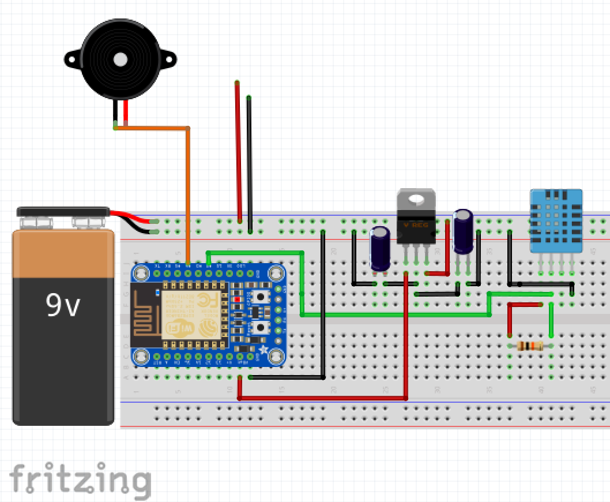

# Smart Smoke Detector

Ever wanted to get alerted of a smoke issue? Do you have a need to sense environment changes? This smart smoke detector is just for you!

Cheesy intros aside, functionality includes the following:

  * Connects to your home wifi network (requires configuration)
  * Connects via MQTT to local server, to allow monitoring of peripherals
  * Reads Temperature & Humidity (DHT11), sends to local server
  * Interrupts upon smoke sensor, and sends a slack notification (if configured)
  * (TESTING:) Low Power mode, keeping battery usage low and enabling longer life span.
  * (TODO:) MQTT retain flag, so known data persists! Currently no way to specify in espruino module.
  * (CONSIDERING:) Battery level monitoring - helpful but draws 20mA! TBD

### Prerequisites

1. You will need a supported ESP8266 micro controller.  Preconfigured boards, thus far, are:
  - [Adafruit's Huzzah Breakout](https://learn.adafruit.com/adafruit-huzzah-esp8266-breakout/overview) or any ESP8266 module of choice
  - [FTDI](https://www.adafruit.com/products/284) * ****optional****, if using an ESP8266 module without usb
1. Your hardware should be flashed with [ThingsSDK Flasher.js](https://github.com/thingsSDK/flasher.js) using the latest [Espruino JS runtime](http://www.espruino.com/EspruinoESP8266).
1. You should have [ThingsSDK-cli](https://github.com/thingsSDK/thingssdk-cli) installed.
1. node.js version 6+
1. [MongoDB](https://docs.mongodb.com/manual/installation/) - To test, setup local instance, or configure to external host.

### Installation

1. `npm install`
1. Connect device via USB or FTDI.
1. Verify device: `thingssdk devices`, and see `devices.json` to validate port and baud rate.
1. Update device to latest version of Espruino with Flasher.js app. *(Project uses 1v91)*
1. Setup project based
1. You're ready to develop!

### Project Build

##### Components (~$25)

  * Smoke Alarm - I'm using a cheap one: "Fire Sentry Smoke Alarm i9040" $7
  * [Adafruit's Huzzah Breakout](https://www.adafruit.com/product/2471) $10 *(NOTE: Do Not solder headers on, this is needed to fit inside the smoke alarm)*
  * DHT11 Temperature Sensor - either sensor or breakout will work
  * L7805CV 5V Voltage Regulator - knocks 9v down to 5v for use with ESP8266
  * 0.47uF Electrolytic Capacitor
  * 0.1uF Electrolytic Capacitor
  * Small PCB for Voltage Regulation
  * Wires, Soldering supplies

##### Schematic

##### Notes

  * Check your suppliers data sheet for the voltage regulator connections!
  * Use the connection from the stock 9v battery within smoke detector to power voltage regulator.
  * Test each cable on your smoke detector to figure out which one triggers the alarm! Use this on Pin #4.

### Development & Deployment

Once all setup is complete, as outlined above, these commands should come in handy:

  * `npm run dev` - Generates valid espruino flavour javascript, uploads to device, starts REPL.
  * `npm run deploy` - Generates valid espruino flavour javascript, uploads to device writeable memory. (Sometimes needs a restart to boot correctly)

### Servers

This project uses Ponte to manage server connections via HTTP & MQTT. This is also used in conjunction with mongoDB. This is configured for local server setup only, for full deployment to outside environment, make sure to configure all server endpoints appropriately!

##### Commands

*TIP: Start each of these commands in a new terminal instance.*

  * `mongod` - Starts local MongoDB instance. * ****optional**** if external host configured.
  * `npm start` - Starts *ponte -v* server. Please make sure to configure `server/config.js` to match your mongo host!
